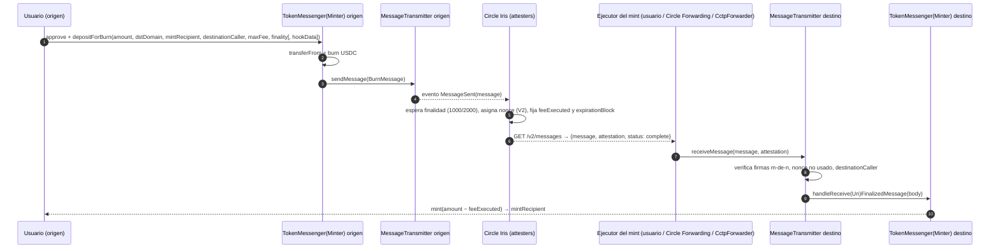

# Transferencias cross-chain de USDC con Circle CCTP

### Ethereum · Avalanche · Arbitrum · Base · Arc · Solana · Sui · Stellar

> Documento técnico del proyecto `usdc-crosschain-lab`. Todos los contratos, dominios, fees y layouts de mensaje
> de este documento se verificaron **on-chain o contra la API oficial de Circle el 2026-10-02** (ver §9, "Evidencia").
> El entorno es **testnet**; las direcciones de mainnet están en la referencia oficial de Circle (§10).

---

## Índice

1. [Resumen ejecutivo y matriz de rutas](#1-resumen-ejecutivo-y-matriz-de-rutas)
2. [Por qué sólo CCTP](#2-por-qué-sólo-cctp)
3. [Conceptos base](#3-conceptos-base)
4. [CCTP en profundidad](#4-cctp-en-profundidad)
5. [Modos de ejecución del mint](#5-modos-de-ejecución-del-mint)
6. [Funcionamiento por red](#6-funcionamiento-por-red)
7. [Flujos por combinación de redes (56 pares)](#7-flujos-por-combinación-de-redes)
8. [Errores comunes y troubleshooting](#8-errores-comunes-y-troubleshooting)
9. [El proyecto, evidencia y estado de las pruebas](#9-el-proyecto-evidencia-y-estado-de-las-pruebas)
10. [Referencias](#10-referencias)

---

## 1. Resumen ejecutivo y matriz de rutas

**CCTP (Cross-Chain Transfer Protocol) mueve USDC nativo quemándolo en la red de origen y minteando la misma
cantidad en la red de destino**, con una firma (atestación) de Circle como prueba. No hay pools, wrappers ni
liquidez intermedia: el USDC que llega es el USDC oficial de Circle en esa red.

### 1.1 Soporte por red (testnet, octubre 2026)

| Red | Dominio CCTP | CCTP V2 | CCTP V1 (legacy) | Decimales USDC | Gas | Atestación Standard |
|---|---|---|---|---|---|---|
| Ethereum Sepolia | 0 | ✅ | ✅ | 6 | ETH | ~15–19 min (Fast ~20 s) |
| Avalanche Fuji | 1 | ✅ | ✅ | 6 | AVAX | ~8 s |
| Arbitrum Sepolia | 3 | ✅ | ✅ | 6 | ETH | ~15–19 min (Fast ~8 s) |
| Base Sepolia | 6 | ✅ | ✅ | 6 | ETH | ~15–19 min (Fast ~8 s) |
| Arc Testnet | 26 | ✅ | ❌ | 6 (ERC-20) / 18 (nativo) | **USDC** | ~0.5 s |
| Solana Devnet | 5 | ✅ | ✅ | 6 | SOL | ~25 s (Fast ~8 s) |
| Sui Testnet | 8 | ❌ | ✅ | 6 | SUI | segundos |
| Stellar Testnet | 27 | ✅ | ❌ | **7** | XLM | ~5 s |

### 1.2 Matriz de rutas (filas = origen, columnas = destino)

`V2` = CCTP V2 directo · `V1` = CCTP V1 directo · `✗` = sin ruta directa → 2 saltos vía una red con V1 y V2 (p. ej. Base)

| origen ↓ / destino → | ETH | AVAX | ARB | BASE | ARC | SOL | SUI | XLM |
|---|---|---|---|---|---|---|---|---|
| **ETH**  | — | V2 | V2 | V2 | V2 | V2 | V1 | V2 |
| **AVAX** | V2 | — | V2 | V2 | V2 | V2 | V1 | V2 |
| **ARB**  | V2 | V2 | — | V2 | V2 | V2 | V1 | V2 |
| **BASE** | V2 | V2 | V2 | — | V2 | V2 | V1 | V2 |
| **ARC**  | V2 | V2 | V2 | V2 | — | V2 | ✗ | V2 |
| **SOL**  | V2 | V2 | V2 | V2 | V2 | — | V1 | V2 |
| **SUI**  | V1 | V1 | V1 | V1 | ✗ | V1 | — | ✗ |
| **XLM**  | V2 | V2 | V2 | V2 | V2 | V2 | ✗ | — |

- **56 pares ordenados → 42 V2 directos · 10 V1 directos (todos con Sui) · 4 en 2 saltos** (Sui↔Arc, Sui↔Stellar). Con el salto intermedio, **las 8 redes quedan conectadas entre sí al 100 %** usando sólo CCTP.
- **Sui sólo tiene CCTP V1**; **Arc y Stellar sólo V2**. Un mensaje V1 sólo lo acepta un `MessageTransmitter` V1 (y viceversa), por eso esos 4 pares necesitan una red "puente" que tenga ambas versiones (Ethereum, Avalanche, Arbitrum, Base o Solana).
- **Fecha límite**: Circle deprecia CCTP V1: reducción de límites desde el **2026-10-31** y pausa de contratos el **2026-12-01**. Circle anunció que desplegará V2 en Sui antes del apagado; cuando eso ocurra, los 14 pares de Sui pasarán a V2 directo y desaparecerán los 2 saltos.

---

## 2. Por qué sólo CCTP

| Criterio | CCTP |
|---|---|
| Cobertura | Las **8 redes** del estudio (Sui vía V1). Ningún protocolo de mensajería genérica cubre hoy Arc + Sui + Stellar para USDC. |
| Activo | USDC **nativo** en ambos lados (sin wrappers, sin pools, sin riesgo de liquidez). |
| Confianza | Sólo Circle, que ya es el emisor del USDC: no añade un tercero. |
| Velocidad | Fast Transfer ~8–20 s en Ethereum/L2/Solana; Standard ~0.5–8 s en Arc, Avalanche y Stellar. |
| Coste | Gas en origen + gas en destino (o fee de forwarding en USDC); fee de protocolo 0 en Standard y 1–1.3 bps en Fast. |
| Mint sin gas en destino | **Forwarding Service** de Circle (§5.2). |
| Lógica en destino | `hookData` firmado dentro del mensaje (§4.6). |

Las soluciones de mensajería genérica que transportan USDC usan CCTP por debajo para el burn/mint y sólo cubren un subconjunto de estas redes; integrar CCTP directamente da la máxima compatibilidad con una única dependencia de confianza.

---

## 3. Conceptos base

### 3.1 USDC nativo vs. "bridged USDC"

- **USDC nativo**: emitido por Circle en cada red y canjeable 1:1 por USD. Lo controla un contrato/programa/paquete de Circle: FiatToken (EVM), SPL mint (Solana), `Coin<USDC>` regulado (Sui), Stellar Asset `USDC:G…` + su Stellar Asset Contract (Stellar).
- **Bridged USDC** (USDC.e, etc.): un bridge bloquea USDC en origen y emite un *wrapper* en destino. Tiene riesgo del bridge y liquidez fragmentada. CCTP lo elimina.

### 3.2 Burn-and-mint en 3 pasos

1. **Burn**: el usuario llama al `TokenMessenger` de origen, que **quema** su USDC y emite un mensaje (`MessageSent`).
2. **Atestación**: el servicio de Circle (**Iris**) observa la red, espera la finalidad pedida y **firma** el mensaje.
3. **Mint**: alguien (el usuario, Circle o un contrato) entrega `mensaje + atestación` al `MessageTransmitter` de destino, que verifica las firmas, marca el nonce como usado y ordena **mintear** USDC al destinatario.

La oferta total no cambia: lo quemado en A = lo minteado en B (menos la fee de V2, si aplica).

### 3.3 Glosario

| Término | Significado |
|---|---|
| **Domain** | ID numérico de CCTP para cada red (≠ chainId). Ej.: Base = 6, Solana = 5, Stellar = 27. |
| **mintRecipient** | `bytes32` con la cuenta que recibe el USDC en destino (codificación por red en §6). |
| **destinationCaller** | `bytes32`; si ≠ 0, **sólo** esa cuenta puede ejecutar el mint en destino. |
| **Attestation** | Firmas ECDSA de los *attesters* de Circle sobre `keccak256(message)`. |
| **Finality threshold** | V2: `1000` = Fast (bloque confirmado), `2000` = Standard (bloque finalizado). |
| **hookData** | Bytes arbitrarios firmados dentro del mensaje V2 (Forwarding Service, CctpForwarder de Stellar, integraciones). |
| **Iris** | API de Circle: `iris-api-sandbox.circle.com` (testnet) / `iris-api.circle.com` (mainnet). |

---

## 4. CCTP en profundidad

### 4.1 Componentes

| Rol | EVM | Solana | Sui (V1) | Stellar |
|---|---|---|---|---|
| Burn (entrada del usuario) | `TokenMessengerV2.depositForBurn[WithHook]` | `TokenMessengerMinterV2` ix `deposit_for_burn[_with_hook]` | `token_messenger_minter::deposit_for_burn` | `TokenMessengerMinter.deposit_for_burn[_with_hook]` |
| Mensajería y verificación | `MessageTransmitterV2` | programa `MessageTransmitterV2` | paquete `message_transmitter` | contrato `MessageTransmitter` |
| Mint/burn del token | `TokenMinterV2` | integrado en TokenMessengerMinter | integrado (usa `Treasury<USDC>`) | integrado en TokenMessengerMinter |
| Mint al usuario | `receiveMessage` | `receive_message` + 11 *remaining accounts* | PTB de 5 llamadas (*hot-potato*) | `CctpForwarder.mint_and_forward` |

Off-chain:

- **Attesters**: conjunto de firmantes de Circle. El `MessageTransmitter` guarda sus direcciones y un umbral *m-de-n*. La atestación es la concatenación de firmas de 65 bytes **ordenadas por dirección del firmante** (orden estrictamente creciente, impide duplicados).
- **Iris API**: `GET /v2/messages/{sourceDomain}?transactionHash={tx}` devuelve `message`, `attestation`, `status` (`pending_confirmations` → `complete`), `eventNonce`, `cctpVersion`, `decodedMessage` y, si se usó forwarding, `forwardState` / `forwardTxHash`. Sirve para V1 y V2. Límite ~35–40 req/s por IP (exceso ⇒ bloqueo de 5 min); el proyecto consulta cada 5 s. El `transactionHash` es el hash EVM, la firma de Solana, el digest de Sui o el hash hex de Stellar.

### 4.2 Direcciones (testnet, verificadas on-chain)

**EVM — CCTP V2** (misma dirección en Ethereum, Avalanche, Arbitrum, Base y Arc; desplegadas con CREATE2):

| Contrato | Dirección |
|---|---|
| TokenMessengerV2 | `0x8FE6B999Dc680CcFDD5Bf7EB0974218be2542DAA` |
| MessageTransmitterV2 | `0xE737e5cEBEEBa77EFE34D4aa090756590b1CE275` |
| TokenMinterV2 | `0xb43db544E2c27092c107639Ad201b3dEfAbcF192` |
| MessageV2 (librería) | `0xbaC0179bB358A8936169a63408C8481D582390C4` |

**EVM — CCTP V1** (legacy; sólo necesario para Sui):

| Red | TokenMessenger | MessageTransmitter |
|---|---|---|
| Ethereum Sepolia | `0x9f3B8679c73C2Fef8b59B4f3444d4e156fb70AA5` | `0x7865fAfC2db2093669d92c0F33AeEF291086BEFD` |
| Avalanche Fuji | `0xeb08f243E5d3FCFF26A9E38Ae5520A669f4019d0` | `0xa9fB1b3009DCb79E2fe346c16a604B8Fa8aE0a79` |
| Arbitrum Sepolia | `0x9f3B8679c73C2Fef8b59B4f3444d4e156fb70AA5` | `0xaCF1ceeF35caAc005e15888dDb8A3515C41B4872` |
| Base Sepolia | `0x9f3B8679c73C2Fef8b59B4f3444d4e156fb70AA5` | `0x7865fAfC2db2093669d92c0F33AeEF291086BEFD` |

**USDC:**

| Red | USDC |
|---|---|
| Ethereum Sepolia | `0x1c7D4B196Cb0C7B01d743Fbc6116a902379C7238` |
| Avalanche Fuji | `0x5425890298aed601595a70AB815c96711a31Bc65` |
| Arbitrum Sepolia | `0x75faf114eafb1BDbe2F0316DF893fd58CE46AA4d` |
| Base Sepolia | `0x036CbD53842c5426634e7929541eC2318f3dCF7e` |
| Arc Testnet | `0x3600000000000000000000000000000000000000` |
| Solana Devnet | mint `4zMMC9srt5Ri5X14GAgXhaHii3GnPAEERYPJgZJDncDU` |
| Sui Testnet | `0xa1ec7fc00a6f40db9693ad1415d0c193ad3906494428cf252621037bd7117e29::usdc::USDC` |
| Stellar Testnet | asset `USDC:GBBD47IF6LWK7P7MDEVSCWR7DPUWV3NY3DTQEVFL4NAT4AQH3ZLLFLA5` · SAC `CBIELTK6YBZJU5UP2WWQEUCYKLPU6AUNZ2BQ4WWFEIE3USCIHMXQDAMA` |

Los IDs de Solana, Sui y Stellar están en §6.

### 4.3 Formato del mensaje

#### V2 — header (148 bytes fijos)

| Offset | Bytes | Campo | Notas |
|---|---|---|---|
| 0 | 4 | `version` | `1` en V2 (`0` en V1) |
| 4 | 4 | `sourceDomain` | |
| 8 | 4 | `destinationDomain` | |
| 12 | 32 | `nonce` | **bytes32 asignado off-chain por Circle** (V1: `uint64` secuencial on-chain) |
| 44 | 32 | `sender` | TokenMessenger de origen |
| 76 | 32 | `recipient` | TokenMessenger(Minter) de destino |
| 108 | 32 | `destinationCaller` | 0 = cualquiera puede ejecutar el mint |
| 140 | 4 | `minFinalityThreshold` | pedido por el usuario (1000/2000) |
| 144 | 4 | `finalityThresholdExecuted` | lo completa Iris: finalidad con la que realmente se atestó |
| 148 | var | `messageBody` | BurnMessageV2 |

#### V2 — BurnMessageV2 (body)

| Offset (en body) | Bytes | Campo |
|---|---|---|
| 0 | 4 | `version` (1) |
| 4 | 32 | `burnToken` (USDC de origen, bytes32) |
| 36 | 32 | `mintRecipient` |
| 68 | 32 | `amount` (**unidades canónicas, 6 decimales**) |
| 100 | 32 | `messageSender` (quien llamó al burn) |
| 132 | 32 | `maxFee` |
| 164 | 32 | `feeExecuted` (lo completa Iris) |
| 196 | 32 | `expirationBlock` (lo completa Iris; ~24 h) |
| 228 | var | `hookData` |

#### V1 — header (116 bytes) + BurnMessage

`version(4)=0 · sourceDomain(4) · destinationDomain(4) · nonce uint64(8) · sender(32) · recipient(32) · destinationCaller(32)` + body `version(4) · burnToken(32) · mintRecipient(32) · amount(32) · messageSender(32)`. Sin fees, sin finalidad configurable, sin hooks.

#### Ejemplo REAL decodificado (Base Sepolia → Arc, Fast + Forwarding)

Burn `0x24b0ab2b…a9a7` en Base Sepolia, localizado con `eth_getLogs` sobre `TokenMessengerV2` y consultado en Iris:

```
00000001                                                           version = 1 (V2)
00000006                                                           sourceDomain = 6 (Base)
0000001a                                                           destinationDomain = 26 (Arc)
0c05a332babcb0ce30885c69536bdc00aabf8f230f59491e17525168c6477428   nonce (asignado por Circle)
0000000000000000000000008fe6b999dc680ccfdd5bf7eb0974218be2542daa   sender = TokenMessengerV2
0000000000000000000000008fe6b999dc680ccfdd5bf7eb0974218be2542daa   recipient = TokenMessengerV2 (Arc)
0000000000000000000000000000000000000000000000000000000000000000   destinationCaller = cualquiera
000003e8                                                           minFinalityThreshold = 1000 (Fast)
000003e8                                                           finalityThresholdExecuted = 1000
--- body ---
00000001                                                           body version
000000000000000000000000036cbd53842c5426634e7929541ec2318f3dcf7e   burnToken = USDC Base Sepolia
0000000000000000000000005caca04d787f5f28e49ad0085275a5056dd542c4   mintRecipient
00000000000000000000000000000000000000000000000000000000001e8480   amount = 2 000 000 (2 USDC)
000000000000000000000000c5567a5e3370d4dbfb0540025078e283e36a363d   messageSender
0000000000000000000000000000000000000000000000000000000000004ecb   maxFee = 20 171 (0.020171 USDC)
0000000000000000000000000000000000000000000000000000000000004ecb   feeExecuted = 20 171
0000000000000000000000000000000000000000000000000000000003e393bd   expirationBlock = 65 246 141
636374702d666f72776172640000000000000000000000000000000000000000   hookData = "cctp-forward"
```

Iris devolvió `forwardState: "COMPLETE"` y `forwardTxHash = destinationMintTxHash = 0x83df2010…9fff`: **Circle ejecutó el mint en Arc** y cobró 0.020171 USDC (fee Fast + fee de forwarding), descontados del monto. Este mensaje es el *fixture* de `src/test/encoding.test.ts`.

### 4.4 Finalidad: Fast vs Standard

| Red de origen | Fast (1000) | Standard (2000) |
|---|---|---|
| Ethereum | 2 bloques, ~20 s | ~65 bloques, ~15–19 min |
| Arbitrum | 1 bloque, ~8 s | ~65 bloques de ETH, ~15–19 min (espera la finalidad de L1) |
| Base | 1 bloque, ~8 s | ~65 bloques de ETH, ~15–19 min |
| Solana | 2–3 slots, ~8 s | 32 slots, ~25 s |
| Avalanche | n/a | 1 bloque, ~8 s |
| Arc | n/a | 1 bloque, ~0.5 s (finalidad determinista) |
| Stellar | n/a | 1 ledger, ~5 s |
| Sui (V1) | n/a | finalidad de checkpoint (segundos) |

- **Fast**: Circle atesta al nivel *confirmed* y cubre el riesgo de reorg con la **Fast Transfer Allowance** (colchón global de USDC, consultable en `GET /v2/fastBurn/USDC/allowance`). Por eso cobra fee. Sólo existe donde mejora el tiempo (Ethereum, Arbitrum, Base, Solana).
- `minFinalityThreshold < 1000` se trata como 1000; `> 1000`, como 2000.
- `expirationBlock`: un mensaje Fast atestado caduca a las ~24 h si no se recibe; se revive con `POST /v2/reattest/{nonce}`. Los fondos no se pierden.

### 4.5 Fees de protocolo (V2)

`GET /v2/burn/USDC/fees/{src}/{dst}` devuelve `minimumFee` **en basis points**. Valores reales (2026-10-02), dependen del origen:

| Origen | Fast | Standard |
|---|---|---|
| Ethereum, Solana | 1 bps | 0 |
| Arbitrum, Base | 1.3 bps | 0 |
| Avalanche, Arc, Stellar | — | 0 |

- El usuario fija `maxFee` (techo, en unidades del token de origen). Si `maxFee` < fee requerida para Fast, el mensaje **se atesta como Standard** (no falla). El proyecto usa `maxFee = ceil(amount × bps / 10 000) × 1.1`.
- La fee se descuenta **del monto minteado**: el destinatario recibe `amount − feeExecuted`.
- Stellar expone además `get_min_fee(burn_token)` on-chain (hoy `0`).
- V1: no tiene fees de protocolo.

### 4.6 Hooks y `destinationCaller`

- `depositForBurnWithHook(…, hookData)`: el hook viaja firmado dentro del mensaje. **CCTP no lo ejecuta**: lo interpreta quien procesa el mint (un contrato integrador, el Forwarding Service o el CctpForwarder de Stellar).
- `destinationCaller ≠ 0`: sólo esa cuenta puede ejecutar el mint. Úsalo cuando un contrato integrador debe ser el único en procesar el hook (evita que un tercero ejecute el mint antes, sin la lógica del hook).

### 4.7 Seguridad y límites

- **Anti-replay**: cada nonce se marca como usado en destino (`usedNonces` en EVM y Solana V1, PDA `used_nonce` en Solana V2, `is_nonce_used` en Stellar, tabla en el estado de Sui).
- **Verificación**: el `MessageTransmitter` recupera los firmantes (`ecrecover` sobre `keccak256(message)`) y exige `threshold` firmas de attesters habilitados, en orden estricto.
- **Límite por mensaje**: `TokenMinter.burnLimitsPerMessage(token)`; en Stellar `get_max_burn_amount_per_message(USDC) = 10¹³` (1 000 000 USDC en 7 decimales).
- **Deny list** (USDC es regulado): blacklist del FiatToken (EVM), `DenyList` global `0x403` (Sui), `require_not_denylisted` (Stellar), cuenta `denylist_account` (Solana V2).
- **Confianza**: si Circle no atesta, no hay mint. CCTP es tan confiable como Circle, que ya es el emisor del USDC.

### 4.8 V1 vs V2

| Aspecto | V1 (legacy) | V2 |
|---|---|---|
| Nonce | `uint64` secuencial on-chain | `bytes32` asignado por Circle |
| Finalidad | sólo finalidad completa | Fast (1000) o Standard (2000) |
| Fees | ninguna | `maxFee` / `feeExecuted` |
| Hooks | no (sólo `depositForBurnWithCaller`) | `depositForBurnWithHook` |
| Forwarding Service | no | sí |
| Cambiar destinatario tras el burn | `replaceDepositForBurn` | no (en su lugar, re-attest) |
| Redes de este estudio | ETH, AVAX, ARB, BASE, SOL, **SUI** | ETH, AVAX, ARB, BASE, SOL, **ARC, XLM** |
| Estado | deprecación 2026-10-31 → pausa 2026-12-01 | versión canónica |

---

## 5. Modos de ejecución del mint

El paso 3 (mint en destino) es una transacción en la red de destino y **alguien tiene que pagar su gas**. El proyecto soporta tres modos:

### 5.1 Mint manual (por defecto)

El propio script ejecuta `receiveMessage` (o su equivalente) en destino con la wallet del usuario. Requiere gas nativo en destino (ETH, AVAX, SOL, SUI, XLM o **USDC en Arc**). Disponible en los 52 pares directos.

### 5.2 Circle Forwarding Service (`--forward`)

Si el burn lleva `hookData = "cctp-forward"` (ASCII, *right-padded* a 32 bytes: `0x636374702d666f7277617264` + ceros), **Circle ejecuta el mint en destino** y cobra el gas en USDC dentro de `feeExecuted`. El usuario no necesita gas ni wallet activa en destino.

- Cotización: `GET /v2/burn/USDC/fees/{src}/{dst}?forward=true` → `forwardFee {low, med, high}` en unidades de USDC (6 dec). `maxFee` debe cubrir `fee de protocolo + forwardFee`.
- Seguimiento: Iris devuelve `forwardState` (`PENDING` → `COMPLETE`/`FAILED`) y `forwardTxHash`. Si falla, el mensaje sigue atestado y se puede hacer el mint manual.
- Sólo V2. **No disponible hacia Stellar** (Iris: "Destination domain not supported for forwarding") ni en pares V1; en esos casos el proyecto avisa y hace el mint manual.

Fee de forwarding real (2026-10-02), según el destino:

| Destino | forwardFee (high) |
|---|---|
| Ethereum | ~2.117 USDC (gas de L1) |
| Arbitrum | ~0.154 USDC |
| Solana | ~0.143 USDC |
| Avalanche | ~0.056 USDC |
| Base | ~0.055 USDC |
| Arc | ~0.019 USDC |
| Stellar | no soportado |

### 5.3 Ruta de 2 saltos (`--via <red>`)

Para Sui↔Arc y Sui↔Stellar: primer salto con la versión que tenga el origen y segundo con la del destino, usando una red con V1 y V2 (Base por defecto). El segundo salto usa el monto realmente recibido en el primero. `--forward` aplica al segundo salto si es V2 y el destino lo soporta.

```
Sui ──CCTP V1──► Base ──CCTP V2──► Arc / Stellar
Arc / Stellar ──CCTP V2──► Base ──CCTP V1──► Sui
```

---

## 6. Funcionamiento por red

### 6.1 EVM: Ethereum, Avalanche, Arbitrum, Base

**Modelo**: cuentas EOA y contratos Solidity. USDC = FiatToken (ERC-20, 6 decimales).

**Burn V2**:
1. `USDC.approve(TokenMessengerV2, amount)`.
2. `TokenMessengerV2.depositForBurn(amount, destinationDomain, mintRecipient, burnToken, destinationCaller, maxFee, minFinalityThreshold)` o `depositForBurnWithHook(…, hookData)`.
3. Internamente: `transferFrom(usuario → TokenMessenger)`, `TokenMinter.burn`, `MessageTransmitterV2.sendMessage` → eventos `MessageSent(bytes message)` y `DepositForBurn(...)`.

**Burn V1 (sólo hacia Sui)**: `approve(TokenMessengerV1)` + `depositForBurn(amount, 8, mintRecipient, burnToken)` (devuelve el `uint64 nonce`).

**Mint**: `MessageTransmitterV2.receiveMessage(message, attestation)` (para mensajes V1: el `MessageTransmitter` V1 de esa red). Cualquiera puede llamarlo si `destinationCaller = 0`; el USDC va siempre al `mintRecipient`, no a quien llama.

**Dirección EVM → bytes32**: *left-pad* con 12 bytes cero: `0x000000000000000000000000<20 bytes>`.

**Diferencias**:
- *Ethereum*: Standard ~15–19 min; Fast ~20 s (1 bps). El mint en L1 es caro: forwarding a Ethereum ~2.1 USDC.
- *Arbitrum / Base* (rollups): Standard espera la **finalidad de L1** (~65 bloques de Ethereum); Fast ~8 s (1.3 bps).
- *Avalanche*: finalidad en ~1 s, Standard ~8 s sin fee; no ofrece Fast.

### 6.2 Arc (L1 de Circle)

- **El gas se paga en USDC**: la moneda nativa es USDC con **18 decimales** y el contrato `0x3600000000000000000000000000000000000000` expone **el mismo saldo** como ERC-20 de **6 decimales**. CCTP usa la interfaz de 6 decimales.
- Consecuencia: para hacer el mint manual en Arc hace falta USDC en Arc. Alternativas: **Forwarding Service** (~0.019 USDC) o faucet de Circle.
- Finalidad determinista (~0.5 s): Standard es instantáneo y sin fee.
- **Sólo V2** (verificado: `MessageTransmitterV2.localDomain() = 26`, sin contratos V1) → Sui↔Arc en 2 saltos.

### 6.3 Solana

**Modelo**: programas Anchor sin estado + cuentas. USDC = SPL mint `4zMMC9…cDU`; los saldos viven en **Associated Token Accounts (ATA)**.

| Programa | V2 | V1 (para Sui) |
|---|---|---|
| MessageTransmitter | `CCTPV2Sm4AdWt5296sk4P66VBZ7bEhcARwFaaS9YPbeC` | `CCTPmbSD7gX1bxKPAmg77w8oFzNFpaQiQUWD43TKaecd` |
| TokenMessengerMinter | `CCTPV2vPZJS2u2BBsUoscuikbYjnpFmbFsvVuJdgUMQe` | `CCTPiPYPc6AsJuwueEnWgSgucamXDZwBd53dQ11YiKX3` |

**Burn (`deposit_for_burn`)** — cuentas y PDAs (seeds):
`owner` (firmante) · `event_rent_payer` · `sender_authority_pda ["sender_authority"]` · `burn_token_account` (ATA del owner) · `denylist_account` (V2, PDA resuelta por Anchor) · `message_transmitter ["message_transmitter"]` · `token_messenger ["token_messenger"]` · `remote_token_messenger ["remote_token_messenger", "<domain>"]` · `token_minter ["token_minter"]` · `local_token ["local_token", mint]` · `burn_token_mint` · **`message_sent_event_data`** (keypair **nuevo** que firma la tx; el MessageTransmitter escribe ahí el mensaje) · programas.
- Args V2: `{amount, destinationDomain, mintRecipient, maxFee, minFinalityThreshold, destinationCaller}` (+ `hookData` con `_with_hook`). Args V1: `{amount, destinationDomain, mintRecipient}`.
- La cuenta de evento cuesta renta (~0.0035 SOL), recuperable con `reclaim_event_account` (V2: tras 5 días).
- Solana como **origen**: `mintRecipient` = dirección destino en bytes32, pasada como `PublicKey`.

**Mint (`receive_message`)**: cuentas `payer, caller, authority_pda ["message_transmitter_authority", tmm_program], message_transmitter, used_nonce, receiver = TokenMessengerMinter, system_program`.
- V2: `used_nonce` = PDA `["used_nonce", nonce32]`. V1: `used_nonces` se obtiene con la vista `get_nonce_pda(nonce, sourceDomain)`.
- **Remaining accounts**, en este orden exacto: `token_messenger · remote_token_messenger ["remote_token_messenger", srcDomain] · token_minter (w) · local_token (w) · token_pair ["token_pair", srcDomain, remoteToken] · [V2: ATA USDC del fee_recipient (w)] · user_token_account (w) · custody ["custody", mint] (w) · token_program · event_authority ["__event_authority"] · TokenMessengerMinter program`.

**Crítico (Solana como destino)**: el `mintRecipient` **es la ATA de USDC**, no la wallet, y **la ATA debe existir** antes de `receive_message` (si no, revierte). El proyecto calcula la ATA (`getAssociatedTokenAddressSync`) y la crea idempotentemente antes del burn.

### 6.4 Sui (CCTP V1)

**Modelo**: objetos Move. USDC = `Coin<0xa1ec…::usdc::USDC>` *regulado* (consulta la `DenyList` global `0x403`). Las transacciones son **PTB** (Programmable Transaction Blocks).

| Objeto | ID testnet (verificado) |
|---|---|
| Paquete MessageTransmitter | `0x4931e06dce648b3931f890035bd196920770e913e43e45990b383f6486fdd0a5` |
| Paquete TokenMessengerMinter | `0x31cc14d80c175ae39777c0238f20594c6d4869cfab199f40b69f3319956b8beb` |
| MessageTransmitterState (shared) | `0x98234bd0fa9ac12cc0a20a144a22e36d6a32f7e0a97baaeaf9c76cdc6d122d2e` |
| TokenMessengerMinterState (shared) | `0x5252abd1137094ed1db3e0d75bc36abcd287aee4bc310f8e047727ef5682e7c2` |
| Treasury\<USDC\> (shared) | `0x7170137d4a6431bf83351ac025baf462909bffe2877d87716374fb42b9629ebe` |

**Burn** (un PTB): `mergeCoins` de los `Coin<USDC>` del usuario → `splitCoins(amount)` → `token_messenger_minter::deposit_for_burn::deposit_for_burn<USDC>(coin, destination_domain, mint_recipient: address, tmm_state, mt_state, deny_list 0x403, treasury)`. Emite `send_message::MessageSent { message: vector<u8> }`. El *digest* (base58) es el `transactionHash` para Iris. Mientras no se haya recibido, el emisor puede usar `replace_deposit_for_burn` para cambiar destinatario o caller.

**Mint**: patrón **hot-potato** en un único PTB de 5 llamadas:
1. `message_transmitter::receive_message::receive_message(message, attestation, mt_state)` → `Receipt` (struct sin `drop`/`store`: **debe** consumirse en el mismo PTB).
2. `token_messenger_minter::handle_receive_message::handle_receive_message<USDC>(receipt, tmm_state, 0x403, treasury)` → mintea y transfiere el `Coin<USDC>`; devuelve `StampReceiptTicketWithBurnMessage`.
3. `…::deconstruct_stamp_receipt_ticket_with_burn_message(ticket)` → `StampReceiptTicket`.
4. `message_transmitter::receive_message::stamp_receipt<MessageTransmitterAuthenticator>(ticket, mt_state)` → `StampedReceipt` (prueba de que el receptor correcto procesó el mensaje).
5. `message_transmitter::receive_message::complete_receive_message(stamped, mt_state)` → marca el nonce y emite `MessageReceived`.

Si cualquier paso falla, todo el PTB revierte: la atomicidad la garantiza el tipo `Receipt`.

**Codificación**: una dirección Sui ya tiene 32 bytes → se usa tal cual como `mintRecipient`.

**Infraestructura**: los fullnodes públicos de Sui **deprecaron JSON-RPC** ("Method not found… migrate to gRPC or GraphQL"): el proyecto usa `SuiGrpcClient` (`@mysten/sui` v2). El faucet de testnet sólo funciona por web (`faucet.sui.io`).

### 6.5 Stellar (CCTP V2 sobre Soroban)

**Modelo**: cuentas `G…` (ed25519), cuentas *muxed* `M…`, contratos Soroban `C…`. USDC es un **asset clásico** (`USDC:GBBD…LFLA5`) con su **Stellar Asset Contract (SAC)** `CBIELTK6…DAMA` para usarlo desde Soroban. **7 decimales**.

| Contrato | Testnet (verificado) |
|---|---|
| TokenMessengerMinter | `CDNG7HXAPBWICI2E3AUBP3YZWZELJLYSB6F5CC7WLDTLTHVM74SLRTHP` |
| MessageTransmitter | `CBJ6MTCKKZG73PMDZCJMSFRD7DQEMI4FKDH7CGDSV4W6FHCRBCQAVVJY` (`get_local_domain() = 27`) |
| CctpForwarder | `CA66Q2WFBND6V4UEB7RD4SAXSVIWMD6RA4X3U32ELVFGXV5PJK4T4VSZ` |

**Decimales**: `get_token_decimal_config(USDC) = {local_decimals: 7, canonical_decimals: 6}`. Al quemar, el contrato **normaliza** el monto local (7 dec) a canónico (6 dec) eliminando el "dust" del 7.º decimal; al mintear multiplica ×10. El mensaje CCTP siempre lleva 6 decimales. Conviene quemar múltiplos de 10 unidades locales.

**Stellar como origen**:
1. `USDC_SAC.approve(from, spender = TokenMessengerMinter, amount: i128 (7 dec), expiration_ledger: u32)`.
2. `TokenMessengerMinter.deposit_for_burn(caller, amount: i128, destination_domain: u32, mint_recipient: BytesN<32>, burn_token: Address(SAC), destination_caller: BytesN<32>, max_fee: i128, min_finality_threshold: u32)` (o `_with_hook(…, hook_data: Bytes)`).
3. Cada invocación Soroban se **simula** (`simulateTransaction`) para obtener footprint y *resource fee*, se ensambla, firma y envía, y se consulta `getTransaction` hasta su confirmación. El hash (hex) es el `transactionHash` para Iris.

**Stellar como destino — `CctpForwarder` obligatorio para cuentas G/M**:
- En el burn de origen: **`mintRecipient = destinationCaller = CctpForwarder`** (32 bytes del contract ID) y `hookData` con el destinatario final:
  ```
  [0..24)  ceros
  [24..28) uint32 BE  versión del hook = 0
  [28..32) uint32 BE  longitud del strkey
  [32..)   strkey del destinatario (G…, M… o C…) en UTF-8
  ```
- En destino: `CctpForwarder.mint_and_forward(message, attestation)` → llama `receive_message` en el MessageTransmitter, el TokenMessengerMinter mintea al forwarder y éste **transfiere atómicamente** al destinatario. Nadie custodia el saldo intermedio.
- **Si se pone una cuenta G… directamente como `mintRecipient`, los fondos quedan atascados para siempre** (el MessageTransmitter de Stellar trata el recipient como contrato `ContractIdHash`).
- La cuenta `G…`/`M…` necesita **trustline** a `USDC:GBBD…` antes de recibir (`changeTrust`); el proyecto la crea automáticamente.
- El Forwarding Service de Circle no soporta Stellar: `mint_and_forward` lo ejecuta una cuenta Stellar con XLM (cualquiera; el proyecto usa la del usuario).

---

## 7. Flujos por combinación de redes

### 7.1 Flujo genérico (los 52 pares directos)



Lo que hace el orquestador del proyecto (`src/cctp/route.ts`):

| Paso | Acción |
|---|---|
| 0 | `planCctp`: V2 si ambas redes la tienen; si no V1; si no, "sin ruta directa" (usar `--via`). |
| 0b | Requisitos del destino: ATA de USDC (Solana), trustline (Stellar). |
| 0c | `mintTargetFor(dst)`: codifica `mintRecipient`, `destinationCaller` y `hookData`. |
| 0d | Fees V2: bps de Iris → `maxFee`; con `--forward` suma `forwardFee.high`. |
| 1 | Burn en origen con el adaptador de la familia (EVM / Solana / Sui / Stellar). |
| 2 | Polling de Iris hasta `status = complete` (o `forwardState = COMPLETE` con forwarding). |
| 3 | Mint en destino con el adaptador de la familia (salvo forwarding) y comparación de saldos antes/después. |

### 7.2 Flujos por familia

#### A) EVM → EVM (ETH, AVAX, ARB, BASE, ARC: 20 pares, todos V2)

1. `approve(TokenMessengerV2)` → `depositForBurn(amount, dstDomain, pad32(destinatario), USDC, 0, maxFee, 1000|2000)`.
2. Iris: `GET /v2/messages/{srcDomain}?transactionHash=0x…`.
3. `MessageTransmitterV2.receiveMessage(message, attestation)` en destino (misma dirección en todas las EVM).
- **→ Arc**: el mint se paga con USDC de Arc; sin saldo allí, `--forward` (~0.019 USDC).
- **Arc →**: Standard sin fee y atestación en ~0.5 s.

#### B) EVM ↔ Solana (10 pares, V2)

- **EVM → Solana**: `mintRecipient = bytes32(ATA_USDC(wallet))`. Crear la ATA antes. Mint con `receive_message` + remaining accounts (§6.3), o `--forward` (~0.143 USDC).
- **Solana → EVM**: `deposit_for_burn` con `mintRecipient = PublicKey(pad32(evm))` y un keypair efímero para `message_sent_event_data`; Iris se consulta con la **firma** de la tx. Mint con `receiveMessage` en EVM.

#### C) EVM ↔ Sui (8 pares, **V1**; Arc excluido)

- **EVM → Sui**: `approve(TokenMessengerV1)` + `TokenMessengerV1.depositForBurn(amount, 8, suiAddress32, USDC)`; atestación V1 en Iris; mint en Sui con el PTB de 5 llamadas.
- **Sui → EVM**: PTB `deposit_for_burn` con `mint_recipient = pad32(evm)`; Iris con el digest; `receiveMessage` en el **MessageTransmitter V1** de esa red (no el V2).
- Sin Fast, sin fees de protocolo, sin forwarding. Disponible hasta la pausa de V1 (2026-12-01).

#### D) EVM ↔ Stellar (10 pares, V2, incluido Arc)

- **EVM → Stellar**: `depositForBurnWithHook(amount, 27, bytes32(CctpForwarder), USDC, bytes32(CctpForwarder), maxFee, 2000, hookData(strkey G…))`. Mint: `CctpForwarder.mint_and_forward(message, attestation)` desde una cuenta Stellar con XLM; el destinatario necesita trustline y recibe `amount × 10` unidades de 7 decimales.
- **Stellar → EVM**: `approve` al TokenMessengerMinter + `deposit_for_burn` con monto en 7 decimales y `mintRecipient = pad32(evm)`. Mint con `receiveMessage` en EVM o `--forward` (p. ej. Stellar→Arc ~0.019 USDC).

#### E) Solana ↔ Sui (2 pares, **V1**)

Se usan los programas **V1** de Solana (`CCTPmbSD…`, `CCTPiPYP…`, IDLs `*_031`). `deposit_for_burn` V1 sólo lleva `{amount, destinationDomain, mintRecipient}`; en `receive_message` V1 la cuenta de nonces se obtiene con la vista `get_nonce_pda` y no hay cuenta de fee recipient.

#### F) Solana ↔ Stellar (2 pares, V2)

- **Solana → Stellar**: `deposit_for_burn_with_hook` con el forwarder como `mintRecipient` y `destinationCaller` + hookData; `mint_and_forward` en Stellar.
- **Stellar → Solana**: `mintRecipient = ATA` (32 bytes) y `receive_message` en Solana (o `--forward`, ~0.143 USDC).

#### G) Sin ruta directa: Sui ↔ Arc, Sui ↔ Stellar (4 pares)

Dos saltos vía una red con V1 y V2 (§5.3): `npm run transfer -- --from sui --to arc --amount 1 --via base [--forward]`. `npm run matrix -- --run` los resuelve automáticamente (`--hop base` por defecto).

### 7.3 Tabla completa de los 56 pares

Mint: `RM` = `receiveMessage` EVM · `RM-V1` = MessageTransmitter V1 · `SOL-RX` = `receive_message` Solana · `SUI-PTB` = PTB de 5 llamadas · `XLM-FWD` = `CctpForwarder.mint_and_forward`. Tiempo = atestación Standard (Fast entre paréntesis). Forwarding = fee real del Forwarding Service (USDC) o `—` si no está disponible.

| # | Origen → Destino | CCTP | Burn | Mint | mintRecipient | Atestación | Forwarding |
|---|---|---|---|---|---|---|---|
| 1 | ETH → AVAX | V2 | depositForBurn | RM | pad32(EVM) | 15–19 min (~20 s) | 0.056 |
| 2 | ETH → ARB | V2 | depositForBurn | RM | pad32(EVM) | 15–19 min (~20 s) | 0.154 |
| 3 | ETH → BASE | V2 | depositForBurn | RM | pad32(EVM) | 15–19 min (~20 s) | 0.055 |
| 4 | ETH → ARC | V2 | depositForBurn | RM | pad32(EVM) | 15–19 min (~20 s) | 0.019 |
| 5 | ETH → SOL | V2 | depositForBurn | SOL-RX | ATA | 15–19 min (~20 s) | 0.143 |
| 6 | ETH → SUI | V1 | depositForBurn V1 | SUI-PTB | address Sui | 15–19 min | — |
| 7 | ETH → XLM | V2 | depositForBurnWithHook | XLM-FWD | CctpForwarder | 15–19 min (~20 s) | — |
| 8 | AVAX → ETH | V2 | depositForBurn | RM | pad32(EVM) | ~8 s | 2.117 |
| 9 | AVAX → ARB | V2 | depositForBurn | RM | pad32(EVM) | ~8 s | 0.154 |
| 10 | AVAX → BASE | V2 | depositForBurn | RM | pad32(EVM) | ~8 s | 0.055 |
| 11 | AVAX → ARC | V2 | depositForBurn | RM | pad32(EVM) | ~8 s | 0.019 |
| 12 | AVAX → SOL | V2 | depositForBurn | SOL-RX | ATA | ~8 s | 0.143 |
| 13 | AVAX → SUI | V1 | depositForBurn V1 | SUI-PTB | address Sui | ~8 s | — |
| 14 | AVAX → XLM | V2 | depositForBurnWithHook | XLM-FWD | CctpForwarder | ~8 s | — |
| 15 | ARB → ETH | V2 | depositForBurn | RM | pad32(EVM) | 15–19 min (~8 s) | 2.117 |
| 16 | ARB → AVAX | V2 | depositForBurn | RM | pad32(EVM) | 15–19 min (~8 s) | 0.056 |
| 17 | ARB → BASE | V2 | depositForBurn | RM | pad32(EVM) | 15–19 min (~8 s) | 0.055 |
| 18 | ARB → ARC | V2 | depositForBurn | RM | pad32(EVM) | 15–19 min (~8 s) | 0.019 |
| 19 | ARB → SOL | V2 | depositForBurn | SOL-RX | ATA | 15–19 min (~8 s) | 0.143 |
| 20 | ARB → SUI | V1 | depositForBurn V1 | SUI-PTB | address Sui | 15–19 min | — |
| 21 | ARB → XLM | V2 | depositForBurnWithHook | XLM-FWD | CctpForwarder | 15–19 min (~8 s) | — |
| 22 | BASE → ETH | V2 | depositForBurn | RM | pad32(EVM) | 15–19 min (~8 s) | 2.117 |
| 23 | BASE → AVAX | V2 | depositForBurn | RM | pad32(EVM) | 15–19 min (~8 s) | 0.056 |
| 24 | BASE → ARB | V2 | depositForBurn | RM | pad32(EVM) | 15–19 min (~8 s) | 0.154 |
| 25 | BASE → ARC | V2 | depositForBurn | RM | pad32(EVM) | 15–19 min (~8 s) | 0.019 |
| 26 | BASE → SOL | V2 | depositForBurn | SOL-RX | ATA | 15–19 min (~8 s) | 0.143 |
| 27 | BASE → SUI | V1 | depositForBurn V1 | SUI-PTB | address Sui | 15–19 min | — |
| 28 | BASE → XLM | V2 | depositForBurnWithHook | XLM-FWD | CctpForwarder | 15–19 min (~8 s) | — |
| 29 | ARC → ETH | V2 | depositForBurn | RM | pad32(EVM) | ~0.5 s | 2.117 |
| 30 | ARC → AVAX | V2 | depositForBurn | RM | pad32(EVM) | ~0.5 s | 0.056 |
| 31 | ARC → ARB | V2 | depositForBurn | RM | pad32(EVM) | ~0.5 s | 0.154 |
| 32 | ARC → BASE | V2 | depositForBurn | RM | pad32(EVM) | ~0.5 s | 0.055 |
| 33 | ARC → SOL | V2 | depositForBurn | SOL-RX | ATA | ~0.5 s | 0.143 |
| 34 | ARC → SUI | 2 saltos | ARC→BASE (V2) + BASE→SUI (V1) | SUI-PTB | address Sui | ~0.5 s + 15–19 min | — |
| 35 | ARC → XLM | V2 | depositForBurnWithHook | XLM-FWD | CctpForwarder | ~0.5 s | — |
| 36 | SOL → ETH | V2 | deposit_for_burn | RM | pad32(EVM) | ~25 s (~8 s) | 2.117 |
| 37 | SOL → AVAX | V2 | deposit_for_burn | RM | pad32(EVM) | ~25 s (~8 s) | 0.056 |
| 38 | SOL → ARB | V2 | deposit_for_burn | RM | pad32(EVM) | ~25 s (~8 s) | 0.154 |
| 39 | SOL → BASE | V2 | deposit_for_burn | RM | pad32(EVM) | ~25 s (~8 s) | 0.055 |
| 40 | SOL → ARC | V2 | deposit_for_burn | RM | pad32(EVM) | ~25 s (~8 s) | 0.019 |
| 41 | SOL → SUI | V1 | deposit_for_burn V1 | SUI-PTB | address Sui | ~25 s | — |
| 42 | SOL → XLM | V2 | deposit_for_burn_with_hook | XLM-FWD | CctpForwarder | ~25 s (~8 s) | — |
| 43 | SUI → ETH | V1 | PTB deposit_for_burn | RM-V1 | pad32(EVM) | segundos | — |
| 44 | SUI → AVAX | V1 | PTB deposit_for_burn | RM-V1 | pad32(EVM) | segundos | — |
| 45 | SUI → ARB | V1 | PTB deposit_for_burn | RM-V1 | pad32(EVM) | segundos | — |
| 46 | SUI → BASE | V1 | PTB deposit_for_burn | RM-V1 | pad32(EVM) | segundos | — |
| 47 | SUI → ARC | 2 saltos | SUI→BASE (V1) + BASE→ARC (V2) | RM | pad32(EVM) | segundos + 15–19 min (~8 s) | 0.019 (2.º salto) |
| 48 | SUI → SOL | V1 | PTB deposit_for_burn | SOL-RX V1 | ATA | segundos | — |
| 49 | SUI → XLM | 2 saltos | SUI→BASE (V1) + BASE→XLM (V2) | XLM-FWD | CctpForwarder | segundos + 15–19 min (~8 s) | — |
| 50 | XLM → ETH | V2 | approve + deposit_for_burn | RM | pad32(EVM) | ~5 s | 2.117 |
| 51 | XLM → AVAX | V2 | approve + deposit_for_burn | RM | pad32(EVM) | ~5 s | 0.056 |
| 52 | XLM → ARB | V2 | approve + deposit_for_burn | RM | pad32(EVM) | ~5 s | 0.155 |
| 53 | XLM → BASE | V2 | approve + deposit_for_burn | RM | pad32(EVM) | ~5 s | 0.055 |
| 54 | XLM → ARC | V2 | approve + deposit_for_burn | RM | pad32(EVM) | ~5 s | 0.019 |
| 55 | XLM → SOL | V2 | approve + deposit_for_burn | SOL-RX | ATA | ~5 s | 0.143 |
| 56 | XLM → SUI | 2 saltos | XLM→BASE (V2) + BASE→SUI (V1) | SUI-PTB | address Sui | ~5 s + 15–19 min | — |

Recuento: **42 V2 directos · 10 V1 directos · 4 en 2 saltos** (A 20 + B 10 + C 8 + D 10 + E 2 + F 2 + G 4 = 56). Con Base como red puente, la atestación Base→X en Standard tarda ~15–19 min (con `--fast`, ~8 s y 1.3 bps); usar Avalanche como puente (`--hop avalanche` / `--via avalanche`) evita esa espera sin fee.

---

## 8. Errores comunes y troubleshooting

| Síntoma | Causa | Solución |
|---|---|---|
| `receiveMessage` revierte "Invalid destination caller" | `destinationCaller ≠ 0` y lo ejecuta otra cuenta | ejecutar con la cuenta autorizada o usar `destinationCaller = 0` |
| "Nonce already used" | el mensaje ya se recibió (p. ej. por el Forwarding Service) | nada que hacer: revisar el saldo |
| `receive_message` en Solana revierte por cuenta inexistente | la ATA de destino no existe | crear la ATA antes (el proyecto lo hace) |
| Fondos atascados hacia Stellar | se usó una cuenta G… como `mintRecipient` | **irrecuperable**: siempre forwarder + hookData |
| `mint_and_forward` falla | el destinatario no tiene trustline USDC | `changeTrust` y reintentar (el mensaje sigue siendo válido) |
| Iris en `pending_confirmations` mucho tiempo | Standard desde Ethereum/L2 (~15–19 min) | esperar o usar `--fast` |
| Se pidió Fast y se atestó como Standard | `maxFee` < fee requerida | recalcular con `/v2/burn/USDC/fees` |
| Iris 429 / bloqueo de 5 min | más de ~35 req/s | polling ≥ 1 s (el proyecto: 5 s) |
| Forwarding `FAILED` | Circle no pudo ejecutar el mint | mint manual con el mismo `message` + `attestation` |
| "Destination domain not supported for forwarding" | destino Stellar | mint manual con `mint_and_forward` |
| Sui "JSON-RPC deprecated" | fullnode público sin JSON-RPC | gRPC (`SuiGrpcClient`) o GraphQL |
| Mensaje V1 hacia Arc/Stellar o V2 hacia Sui | versiones incompatibles | 2 saltos vía ETH/AVAX/ARB/BASE/SOL |
| Llega 1 unidad menos desde Stellar | dust del 7.º decimal | usar múltiplos de 10 unidades locales |
| Sin gas en Arc para el mint | el gas de Arc es USDC | `--forward` o faucet de Circle |

---

## 9. El proyecto, evidencia y estado de las pruebas

### 9.1 Estructura de `usdc-crosschain-lab`

```
src/config/chains.ts   dominios, contratos V1/V2, USDC, RPCs (verificados on-chain)
src/lib/encoding.ts    bytes32 por red (pad EVM, ATA Solana, address Sui, CctpForwarder + hookData), decimales 6/7
src/lib/iris.ts        API de Circle: mensajes, atestaciones, fees (bps), forwarding (fee + estado)
src/cctp/evm.ts        depositForBurn[WithHook] V2 / depositForBurn V1 / receiveMessage (viem)
src/cctp/solana.ts     deposit_for_burn / receive_message V2 y V1 (Anchor + IDLs oficiales de Circle)
src/cctp/sui.ts        deposit_for_burn y PTB hot-potato de 5 llamadas (V1, gRPC)
src/cctp/stellar.ts    approve + deposit_for_burn[_with_hook], CctpForwarder.mint_and_forward (Soroban)
src/cctp/route.ts      orquestador: elige V1/V2, fees, burn → atestación → mint, forwarding
src/scripts/           verify · matrix (--quote / --run) · transfer · balances · faucet · new-wallets
src/test/              tests offline
```

### 9.2 `npm run verify` — contratos on-chain (2026-10-02)

- **EVM**: `MessageTransmitterV2.localDomain()` = 0/1/3/6/26 en Sepolia/Fuji/Arbitrum/Base/Arc; `MessageTransmitterV1.localDomain()` = 0/1/3/6 (Arc no tiene V1); código presente en los 5 USDC.
- **Solana Devnet**: programas CCTP V1 y V2 desplegados y ejecutables; mint USDC presente.
- **Sui Testnet** (gRPC): paquetes MessageTransmitter y TokenMessengerMinter, sus `State` (`…::state::State`), `Treasury<USDC>` y el paquete USDC existen.
- **Stellar Testnet** (simulación Soroban): `get_local_domain() = 27`, `get_version() = 1`, `get_local_message_transmitter()` = `CctpForwarder.get_message_transmitter()` = `CBJ6MTCK…VVJY`, `get_token_decimal_config(USDC) = {local 7, canonical 6}`, `get_min_fee = 0`, `get_max_burn_amount_per_message = 10¹³`, SAC `decimals() = 7`, `symbol() = USDC`. Las firmas de `deposit_for_burn`, `deposit_for_burn_with_hook` y `mint_and_forward` se leyeron del *spec* on-chain y coinciden con el código.

### 9.3 `npm run matrix -- --quote`
Fees de protocolo de los 42 pares V2 (tabla §4.5) y fees de forwarding (tablas §5.2 y §7.3), obtenidas de Iris. Resultado en `results/quotes.json`.

### 9.4 Prueba de humo en Stellar (sin USDC)
Con la wallet de laboratorio (XLM pero 0 USDC): `approve` se ejecutó on-chain y la simulación de `deposit_for_burn` (Stellar → Base) pasó la autorización y la validación de argumentos y falló **en `transfer_from` del SAC por saldo** (`0 − 1 000 000`), lo que confirma que la codificación de los parámetros es correcta contra el contrato real.

### 9.5 Tests (`npm test`): 6/6 OK
Layout real del mensaje V2, codificación bytes32 (EVM/Solana/forwarder de Stellar + hookData), escalado 6↔7 decimales, cálculo de `maxFee` y planificación V1/V2/2 saltos.

### 9.6 Transferencias end-to-end
**Pendientes de fondos y claves** en las wallets del laboratorio. Saldos testnet de las wallets públicas de v52 (sólo lectura):

| Wallet v52 | USDC | Gas |
|---|---|---|
| `0xf92A…8339` (seller x402) | 60.04 Fuji | 6 AVAX · 0.05 ETH Sepolia · 0.01 ETH Arbitrum |
| `0x5C18…135C` (deployer) | 13.82 Sepolia · 20.02 Fuji | 0.064 ETH · 0.2 AVAX |
| `0x0f26…04C7` (buyer x402 / deployer testnet) | 19.98 Fuji · 10 Base | 1.5 AVAX |
| `0x4ff1…ab8c` (signer del OpenZeppelin Relayer) | 0 | ~1 AVAX |

Con una de esas claves en `.env` (`EVM_PRIVATE_KEY`) se pueden ejecutar todos los pares desde Fuji/Sepolia, y con `--forward` llegar a Arc, Base, Arbitrum y Solana sin gas en destino. Para Sui y Solana hace falta además gas de sus faucets web. `npm run matrix -- --run` ejecuta los 56 pares y deja cada resultado (txs, tiempos, fees, saldos antes/después) en `results/transfers.jsonl`.

---

## 10. Referencias

- Circle — redes soportadas: https://developers.circle.com/cctp/cctp-supported-blockchains
- Circle — contratos EVM V2: https://developers.circle.com/cctp/evm-smart-contracts · V1: https://developers.circle.com/cctp/v1/evm-smart-contracts
- Circle — programas Solana: https://developers.circle.com/cctp/solana-programs · repo `circlefin/solana-cctp-contracts`
- Circle — paquetes Sui (V1): https://developers.circle.com/cctp/v1/sui-packages · repo `circlefin/sui-cctp`
- Circle — contratos Stellar: https://developers.circle.com/cctp/references/stellar-contracts · quickstart Arc↔Stellar: https://developers.circle.com/cctp/quickstarts/transfer-usdc-stellar-arc · repo `circlefin/stellar-cctp`
- Circle — guía técnica (mensaje, finalidad, fees, hooks): https://developers.circle.com/cctp/technical-guide
- Circle — confirmaciones de bloque: https://developers.circle.com/cctp/required-block-confirmations
- Circle — direcciones de USDC: https://developers.circle.com/stablecoins/usdc-contract-addresses
- Circle — deprecación de V1: https://www.circle.com/blog/cctp-version-updates
- Circle — Forwarding Service: https://www.circle.com/blog/introducing-our-new-crosschain-forwarding-service-now-integrated-into-cctp
